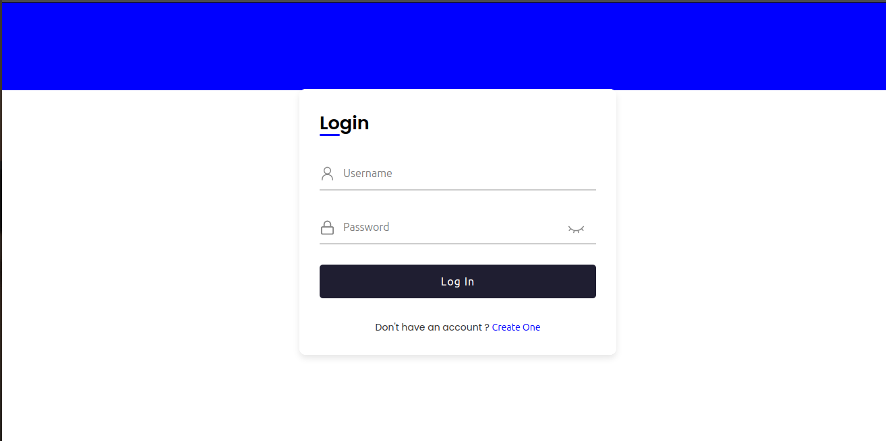
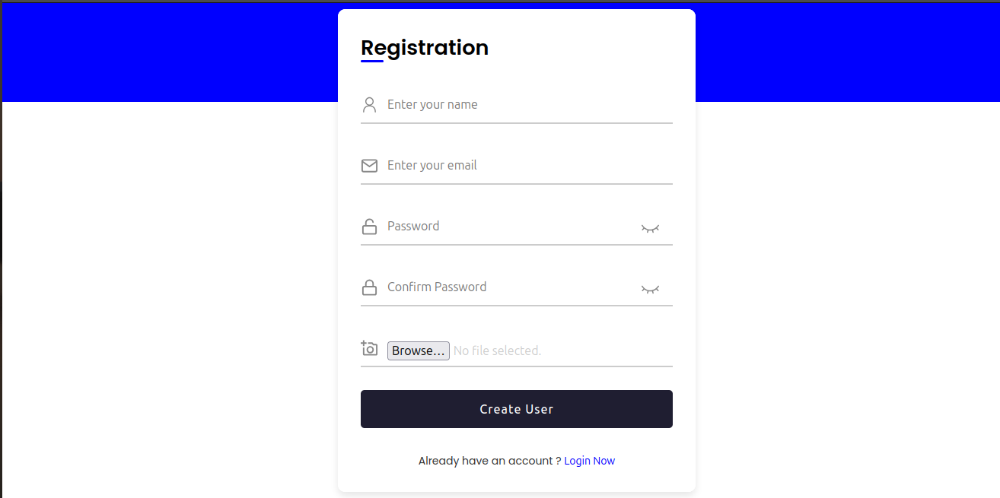
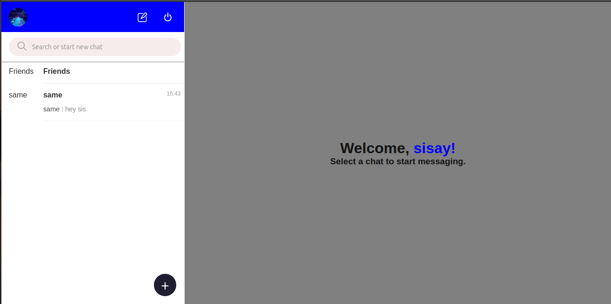

## Features

- Real-time Messaging: Users can chat with each other in real time, sending and receiving messages instantly without the need to refresh the page.

- User Authentication: The application supports user registration and authentication, ensuring secure access to the chat functionality.

- Group Chats: Users can create or join group chats, allowing them to communicate with multiple participants simultaneously.

- Message History: The application keeps a history of previous messages, allowing users to view their chat history and scroll through past conversations.

- Emojis and Media Sharing: Users can enhance their conversations by sending emojis and sharing media files such as images or videos.

## Technologies Used

The project is built using the MERN stack, which consists of the following technologies:

- MongoDB: A NoSQL database used to store and manage user information, chat messages, and other relevant data.

- Express.js: A web application framework for Node.js that handles server-side logic and API routes.

- React: A JavaScript library for building user interfaces, used to create the client-side of the application.

- Node.js: A JavaScript runtime environment used for server-side development and running the Express.js server.

- Socket.IO: A library that enables real-time, bidirectional communication between the server and the clients, facilitating instant messaging.

- SCSS: A CSS preprocessor that provides additional features and enhancements to standard CSS, such as variables, nesting, and modular organization.

- Docker: Docker is a software platform used to develop, ship, and run applications within lightweight containers, essentially packaging software into standardized units that include everything needed to run.

## Usage

To use the Chat App MERN, follow these steps:

1. Clone the repository:
##
      git clone https://github.com/sisayalemu/GO2COD_FS_03.git
2. Navigate to project directory:
##
      cd real-time-chat-app
3. Install the dependencies:
##
      npm install
4. Navigate to Server directory of the project:
##
      cd real-time-chat-app/server
5. Install the dependencies:
##
      npm install
6. Navigate to Client directory of the project:
##
      cd real-time-chat-app/client
7. Install the dependencies:
##
      npm install
8. Navigate to Server Set up the environment variables Create a `.env` file: 
##
      cd real-time-chat-app/server && vi .env
10. Start the development server:
##
      npm start
11. Navigate to client and Start the development server:
##
      npm run start
12. Access the application in your web browser:
##
      http://localhost:3000

## Screenshots

<h3 align="center">Login Page</h3>

*Login page with Login component*

*Login page with Register component*

<h3 align="center">Chat Page</h3>

